# Logistics Manager - Sistema Gestionale per la Logistica

Sviluppato durante il periodo di stage presso Fiven, questo applicativo è stato progettato per la digitalizzazione e l'ottimizzazione dei flussi di magazzino. Il progetto gestisce l'intero ciclo di vita della merce, dall'accettazione dei Documenti di Trasporto (DDT) alla creazione di pallet pronti per la spedizione.

## Stack Tecnologico
* Backend: Java 20, Spring Boot
* Persistenza: MyBatis (Mapper Pattern)
* Database: MySQL (Ambiente MAMP)
* Frontend: HTML5, Thymeleaf, Bootstrap 5, CSS3 Custom
* Sicurezza: Spring Security

---

## Panoramica del Sistema

### 1. Accesso e Sicurezza
Il sistema è protetto da un modulo di autenticazione che gestisce le sessioni utente e protegge le rotte sensibili.

### 2. Dashboard e Anagrafica Clienti
Visualizzazione centralizzata dei partner commerciali e dei servizi offerti.
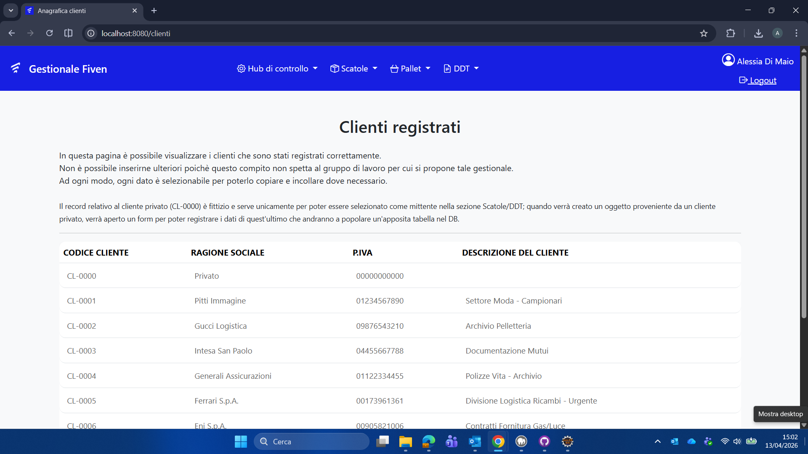
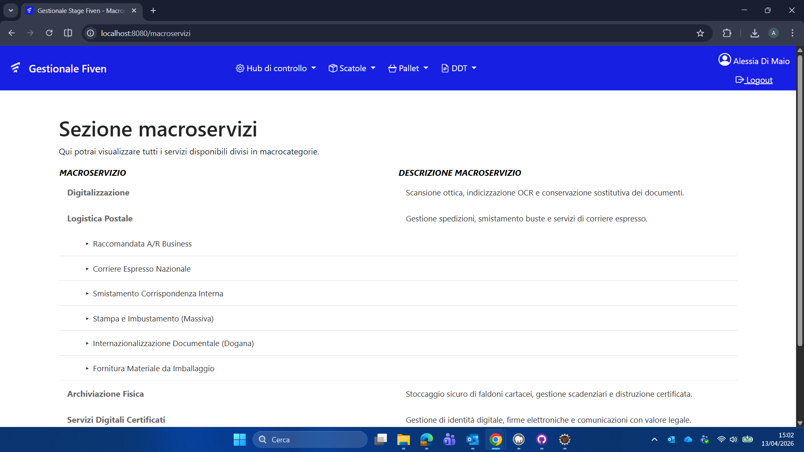

### 3. Gestione Scatole e Filtri Avanzati
Questa sezione rappresenta il cuore del frontend custom. Include una sidebar con logica di filtraggio complessa sviluppata senza dipendenze esterne.
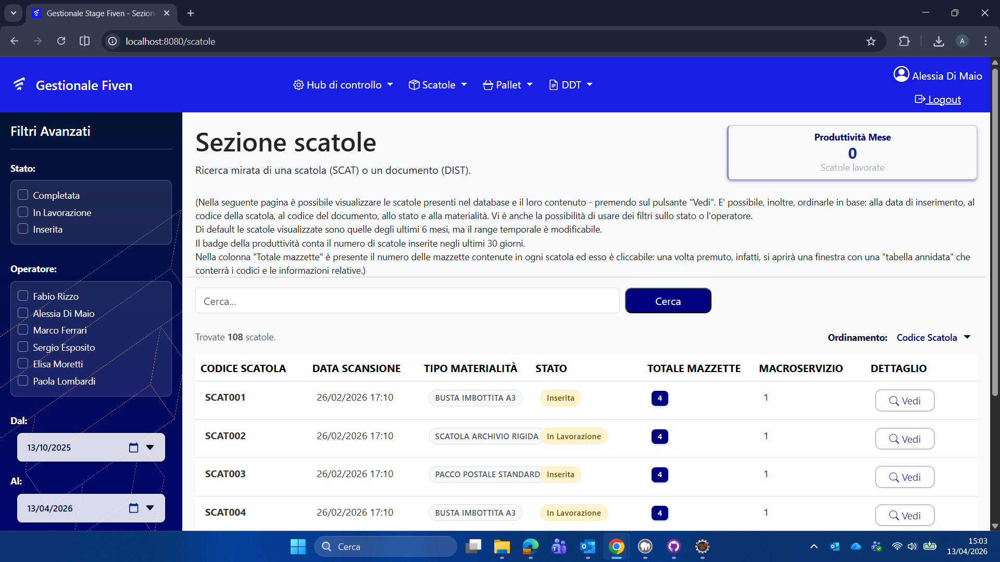
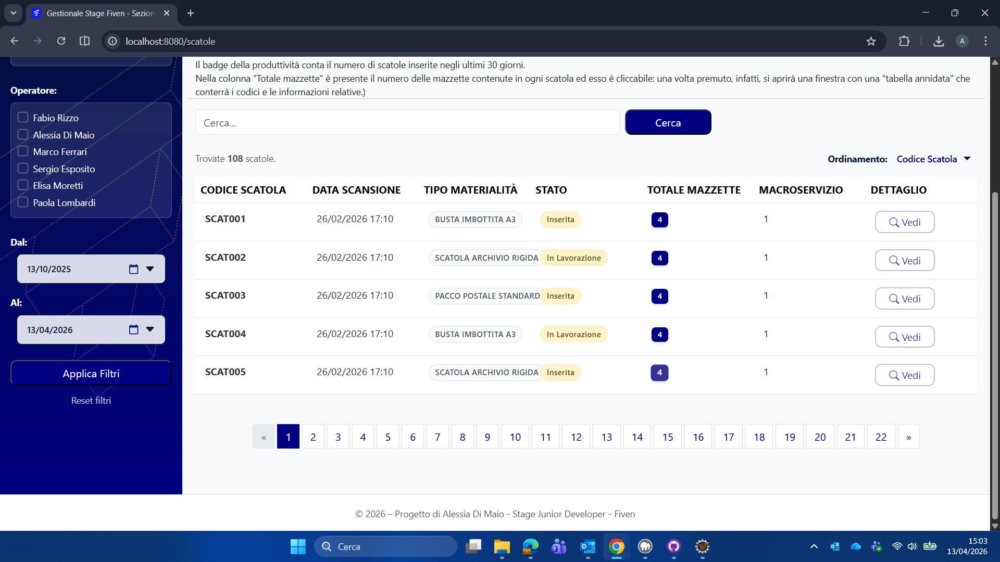
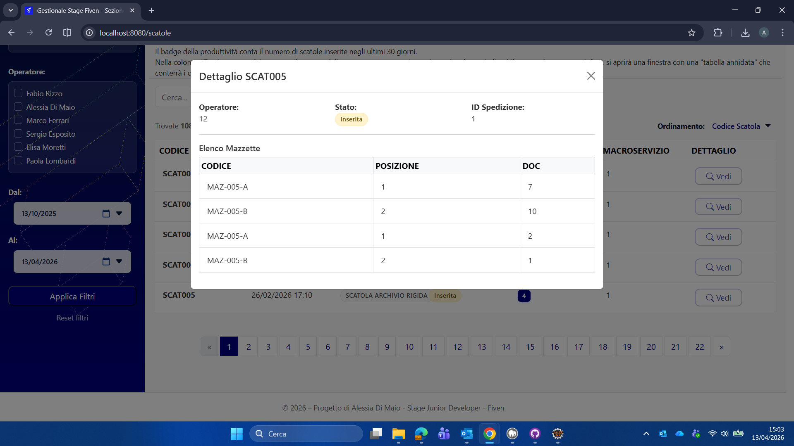

### 4. Inserimento e Tracciabilità
Modulo per l'inserimento di nuovi colli con integrazione per la scansione o generazione di codici identificativi.
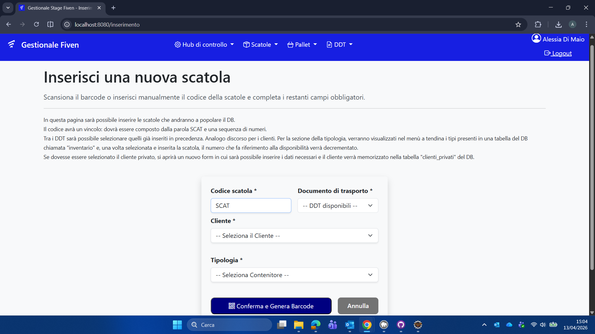

### 5. Reggiatura e Fine Linea
Interfaccia dedicata alla preparazione delle scatole (reggiatura) prima dell'associazione al pallet.
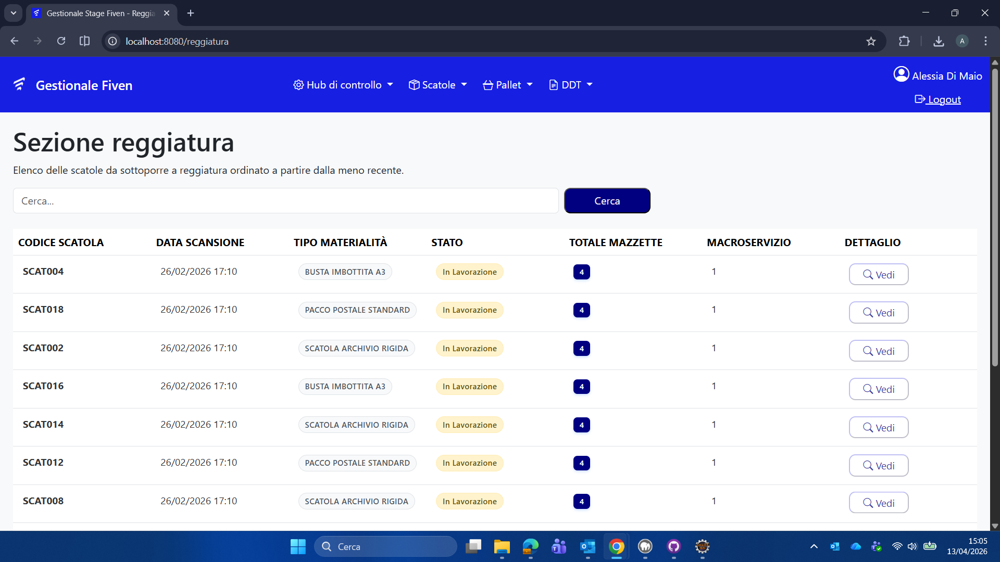

### 6. Composizione Pallet e Logica di Chiusura
Processo di aggregazione delle scatole all'interno di un'unità pallet, con riepilogo finale prima della registrazione definitiva.
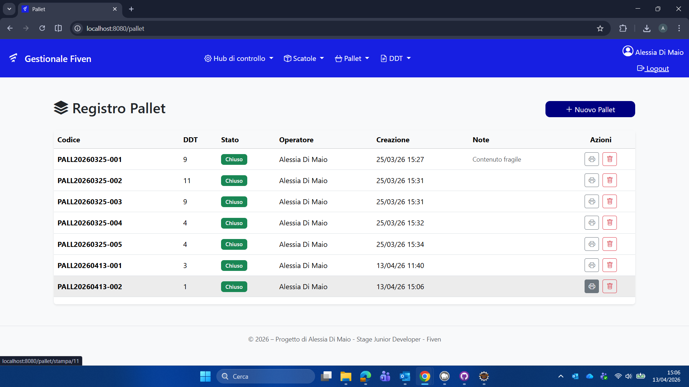
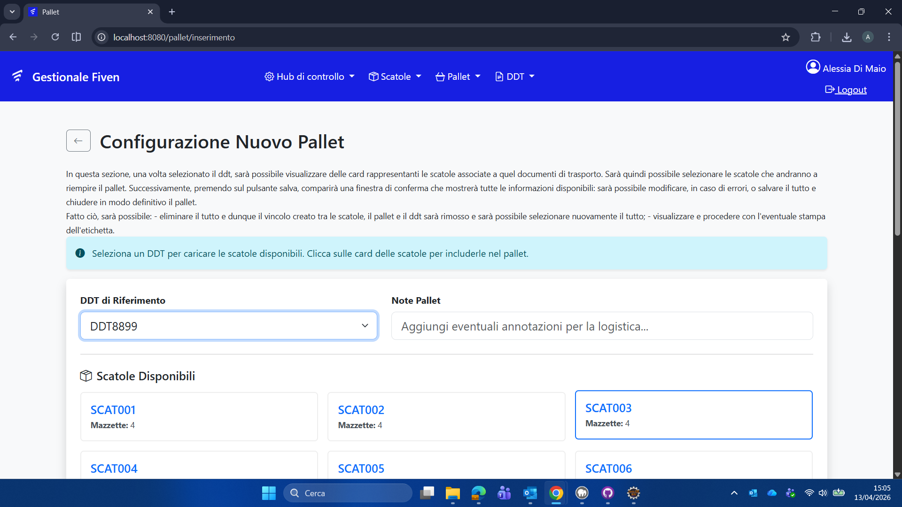
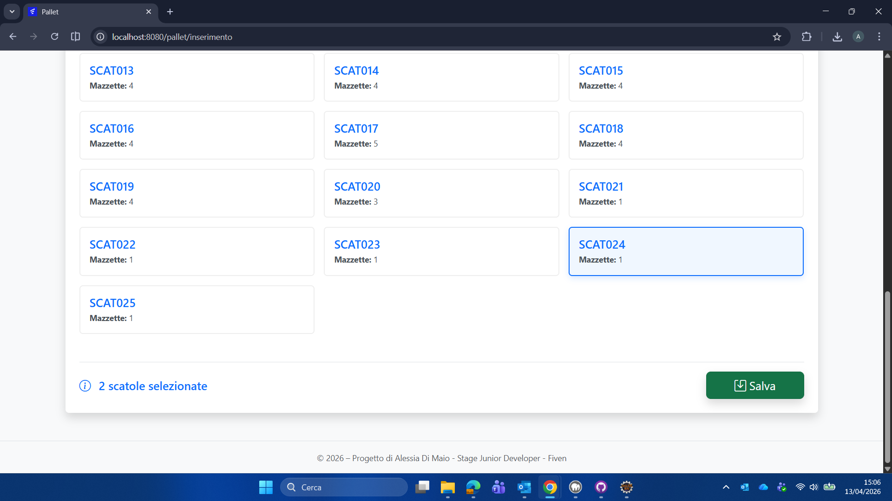
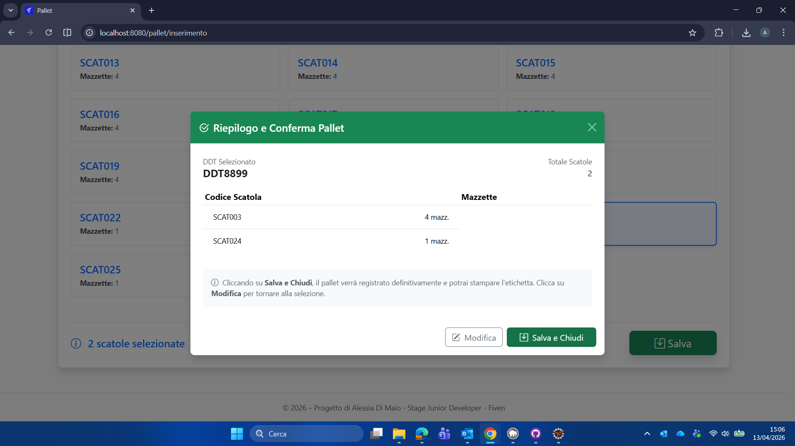

### 7. Modulo di Stampa Etichette
Generazione dinamica di etichette professionali complete di barcode e riepilogo mazzette per l'identificazione fisica dei pallet.
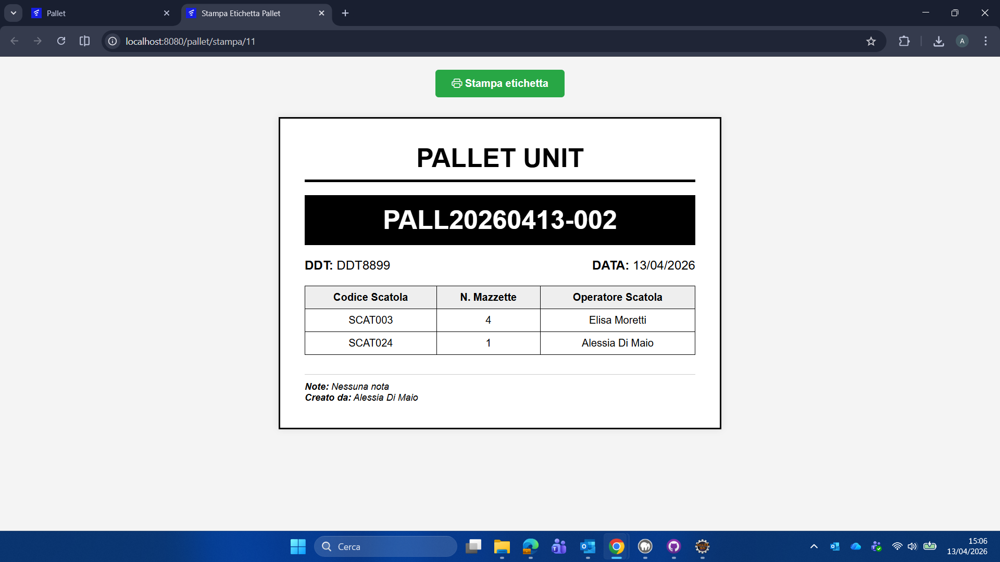
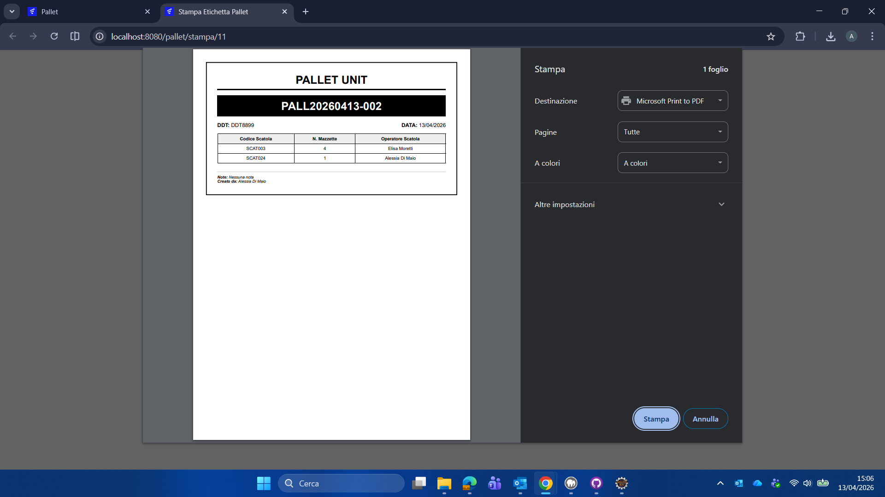

---

## Note Implementative: MyBatis Mapper
A differenza di precedenti implementazioni basate su standard differenti, in questa release è stato scelto MyBatis per garantire:
* Controllo granulare sulle query SQL.
* Ottimizzazione delle performance nelle join complesse tra DDT, Scatole e Pallet.
* Separazione netta tra logica applicativa e mappatura dei dati.

## Istruzioni per l'Installazione
1.  Importare il database tramite il file SQL presente nella cartella `/database`.
2.  Configurare le credenziali MySQL nel file `application.properties` (Porta default MAMP: 3306).
3.  Eseguire l'applicazione tramite Maven.
